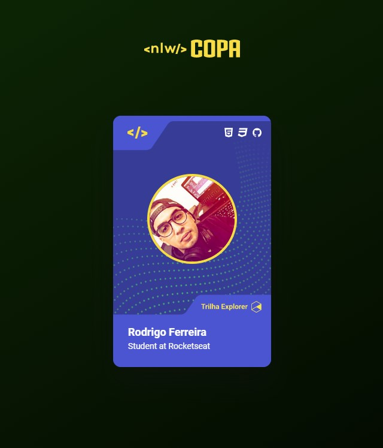

<h1 align="center"> Card NLW Copa </h1>

  Projeto simples feito para aquecimento da NLW Copa.

 

  

## 🚀 Tecnologias

Esse projeto foi desenvolvido com as seguintes tecnologias:

- <strong>
     
      HTML
  </strong>
- <strong>
     
      CSS
  </strong>
- <strong>
      
      Javascript
  </strong>

## 💻 Projeto

O Card NLW Copa é um cartão que simula a famosa figurinha da Copa do Mundo, no estilo da NLW Copa. Clicando no cartão o tema muda de acordo com as trilhas de estudo do evento.

## 🌐 Link 

<a href="https://rodrigoaraujoferreira.github.io/Card-personalizado-NLW-Copa/card.html" target="_blank">Clique aqui para acessar a versão atual do projeto.</a>
